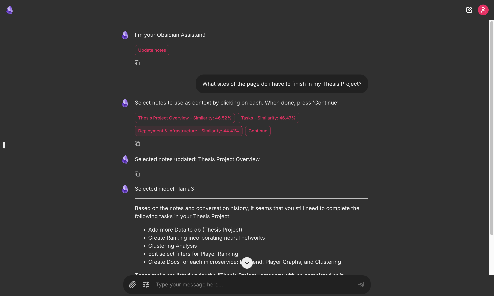

# Chainlit Desktop Application for Obsidian Chatbot

This project is a desktop application for an AI chatbot built with Chainlit, designed to interact with notes in an Obsidian vault. The chatbot is accessible via a desktop app powered by Electron, allowing you to run queries on your notes, access task lists, and retrieve relevant information from your Obsidian knowledge base.



## Features

- **Obsidian Integration**: Retrieve notes from your Obsidian vault based on similarity to user queries.
- **AI-Powered Chat**: Uses OpenAI models (GPT-4o-mini, GPT-4o) or a local Llama3 model to answer questions based on your notes and tasks.
- **Embedded FAISS Indexing**: Efficiently indexes notes for fast similarity search.
- **Electron Desktop App**: Easy-to-use desktop interface for convenient access to your chatbot.
- **Dynamic Note Updating**: Update notes and re-generate embeddings at any time to keep data up-to-date.

## Getting Started

### Prerequisites

- **Node.js** and **npm**
- **Python** (with Chainlit, OpenAI, FAISS, and other dependencies)
- **Obsidian** (with a vault directory containing notes)
- **Ollama** (for running the local Llama3 model)

### Installation

1. Clone the repository:
    ```bash
    git clone https://github.com/perrohombre/ObsidianMD_Chatbot
    cd ObsidianMD_Chatbot
    ```

2. Install Node.js dependencies:
    ```bash
    npm install
    ```

3. Install Python dependencies:
    ```bash
    pip install chainlit openai faiss-cpu numpy
    ```

4. Install Ollama and the Llama3 model (for macOS):
   - Install **Ollama** following [Ollama’s installation guide](https://ollama.com/download).
   - Once installed, download the **Llama3** model:
     ```bash
     ollama pull llama3
     ```

5. Set up your environment variables:
   - Create a `.env` file and add your OpenAI API key:
     ```plaintext
     OPENAI_API_KEY=your_openai_api_key
     OBSIDIAN_VAULT_PATH=/Your/Path/To/Vault
     OBSIDIAN_VAULT_NAME=your_vault_name
     ```


### Running the Application

To start the application, use the following command:

```bash
npm start
```

This will concurrently run the Chainlit server and open the Electron desktop application. Make sure Obsidian is running if you want to use links to open notes directly.

### Running the Llama3 Model Locally with Ollama

If you’ve selected “llama3” as the model in the chatbot interface, ensure the Ollama server is running to handle Llama3 model queries.

	•	Start Ollama: The Ollama service should run automatically if installed. If needed, you can manually start it to confirm:

```bash
ollama serve
```

This will allow the Chainlit app to communicate with the Llama3 model locally for AI-based answers without relying on OpenAI’s servers.


## Application Structure

	•	obsidian_chatbot.py: The main Python script for the Chainlit chatbot, including functions for loading notes, generating embeddings, and handling chat interactions.
	•	main.js: The Electron app’s entry point, which loads the chatbot interface in a desktop window.
	•	package.json: Defines the app’s dependencies and scripts.
	•	.env: Stores environment variables such as the OpenAI API key.

## Scripts

	•	npm start: Runs the Chainlit server and Electron app concurrently.
	•	npm run build: Builds the Electron app for macOS (see configuration in package.json).

## Built With

	•	Chainlit
	•	Electron
	•	FAISS
	•	Ollama (for Llama3 model)

## Notes

	•	Ensure your environment variables are correctly set in .env file.
	•	The app is configured for macOS, but other OS builds can be added in package.json.

Let me know if you need further modifications!
